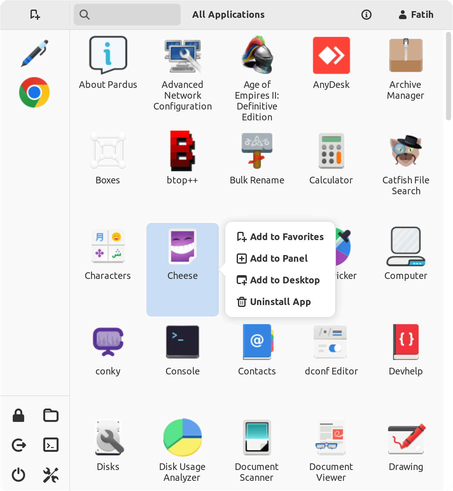
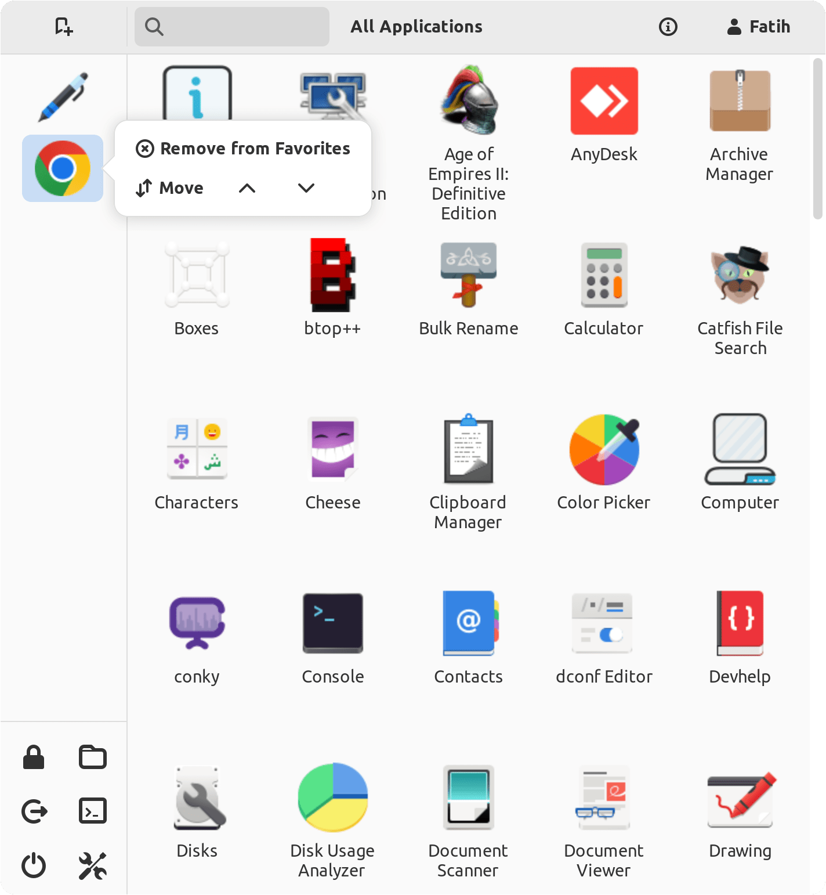

# ETA Menu

ETA Menu is a menu application.

[](https://repology.org/project/eta-menu/versions)

### **Dependencies**

This application is developed based on Python3 and GTK+ 3. Dependencies:
```bash
gir1.2-ayatanaappindicator3-0.1 gir1.2-glib-2.0 gir1.2-gtk-3.0
```

### **Run Application from Source**

Install dependencies
```bash
sudo apt install gir1.2-ayatanaappindicator3-0.1 gir1.2-glib-2.0 gir1.2-gtk-3.0
```

Clone the repository
```bash
git clone https://github.com/pardus/eta-menu.git ~/eta-menu
```

Run application
```bash
python3 ~/eta-menu/src/Main.py
```
## Platform Note

This application is intended to run on Debian-based Linux distributions.
The dependency installation steps use `apt`, which is not available on macOS or Windows.

Development and testing should be performed on a Debian-based Linux environment
(e.g. Pardus, Ubuntu).

### **Build deb package**

```bash
sudo apt install devscripts git-buildpackage
sudo mk-build-deps -ir
gbp buildpackage --git-export-dir=/tmp/build/eta-menu -us -uc
```

### **Screenshots**



